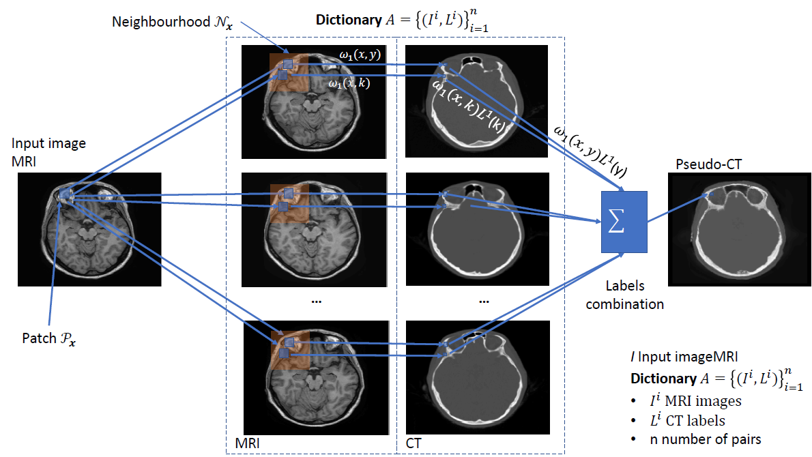
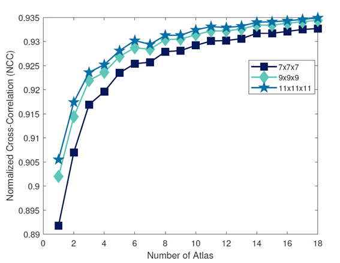
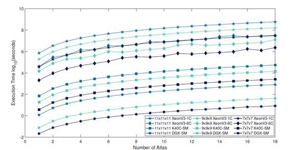
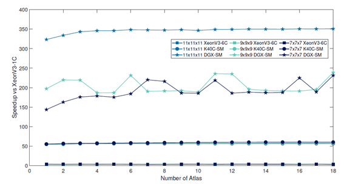

# PseudoCTImaging
pseudo-CT estimation based on multi-atlas with patches on mutlicore and manycore platforms (see [1,2]). CT acquisition modality provides the electron densities necessary to obtain an attenuation map for PET. The synthesis of a pseudo-CT image from MRI images is a natural solution to correct PET when PET/MR multimodality is considered. The basic idea is as follows: 1) generate a pseudo-CT given an input MRI image, 2) calculate the attenuation maps from the pseudo-CT volume, and  3) apply the attenuation map to correct the PET image. We are going to focus on the first step producing the pseudo-CT image: synthesis.  
This algorithm has been implemented using:  

 * Single core intel icc
 * Multicore OpenMP
 * GPU (CUDA) with three optimizations
    * GM Global Memroy
    * GM2 Global memory with registers improvement 
    * SM Shared memory 
           

Matlab functions read the data for the input MRI, the anatomy atlas and write the result of the segmentation in a Matlab file .mat. There is a way to create data randomly for testing purposes. In future I will extend read the data with the MatrixIO. For connivence I have implemented the algorithm in only one class to facilitate the deployment in the server (compile and execute). In future I will improve the modularity and create a dll for using a UI.   
Figure below illustrates schematically the workflow of our proposal. The input parameters are an input image $I$ representing the modality from we want to do the synthesis from, an anatomy atlas $\mathcal{A}$ which contains a set of image pairs of two different modalities: $\mathcal{A} =\{(\mathcal{I}^{i},L^{i})\}^n_{i=1}$. In our case, $\mathcal{I}^{i}$ are MRI images and $L^i$ CT images labels and $\mathcal{N}$ is the specific neighbourhood. We assume that $\mathcal{I}^{i}$ and $L^{i}$ are spatially aligned. We compare the similarity between the input image and the MRI images in the atlas within neighbourhood and combine these similarities to produce the segmentation output ($\hat{L}$) through the labels in the anatomy atlas.  
 

We also present the experiments performed to quantitatively measure the GPU performance compared to a CPU single and multicore solution. We show qualitative and quantitative results that reinforce the idea of our proposal.  

Results with the following platforms  

and the speedup among them

The code has been implemented in Visual Studio 2015 Community with Intel compiler 19.0 and CUDA 9.0. You can compile the code in linux with the following commands.  
nvcc kernelPatchBasedCT.cu -o kernelPatchBasedCT -gencode=arch=compute_30,code=\"sm_30,compute_30\"  --machine 64 -I /usr/local/cuda-10.0/samples/common/inc/ --ptxas-options=-v  
CPU Parameters
1. Data.mat Anatomy atlas I, \mathcal{A} =\{(\mathcal{I}^{i},L^{i})\}^n_{i=1}. Atlas dimension is inferred from the data
2. Name for the mat file result
3. EXEC_CHOICE {SingleCore = 0, MultiCore = 1, SingleCoreTestTime = 2, MultiCoreTestTime = 3, } 
4. NH {7,9,11} 
5. TH Number of threads optional only with MultiCore 
6. sigma 1 default (2.5) optional only with MultiCore/SingleCore. sigma is the standard deviation of the noise in the images given by Signal Noise Ratio (SNR), but we can expect that images have a good SNR
7. beta 1 default optional only with MultiCore/SingleCore. Beta is a positive real number that influences the difficulty to accept patches with less or more similarity

CUDA
1. Data.mat Anatomy atlas I, \mathcal{A} =\{(\mathcal{I}^{i},L^{i})\}^n_{i=1}. Atlas dimension is inferred from the data
2. Name for the mat file result
3. EXEC_CHOICE {GM = 0, 	GM2 = 1, 	SM = 2, 	GpuTestTime=4 } 
4. NH {7,9,11} 
5. sigma 1 default (2.5) optional only with MultiCore/SingleCore. sigma is the standard deviation of the noise in the images given by Signal Noise Ratio (SNR), but we can expect that images have a good SNR
6. beta 1 default optional only with MultiCore/SingleCore. Beta is a positive real number that influences the difficulty to accept patches with less or more similarity
7. cuda device default 0

Some examples of execution are:  

* **CPU** PatchBasedPseudoCT.exe data\Subject_08_AtlasSize_01.mat Subject_08_AtlasSize_01_7Nh_MC_TH12 0 7 12 2.5 1
* **CUDA** PatchBasedPseudoCT.exe data\Subject_08_AtlasSize_01.mat Subject_08_AtlasSize_01_Op2_Rd_7Nh 2 7 2.5 1

This code implements the following paper "Real-time patch-based medical image modality propagation by GPU computing" https://link.springer.com/article/10.1007/s11554-016-0568-0  

If you use this software for research purposes, please CITE the corresponding of the following papers in any resulting publication:  

[1] Alcaín, E., Torrado-Carvajal, A., Montemayor, A.S. et al. Real-time patch-based medical image modality propagation by GPU computing. J Real-Time Image Proc 13, 193–204 (2017). https://doi.org/10.1007/s11554-016-0568-0  
[2] Angel Torrado-Carvajal, Joaquin L. Herraiz, Eduardo Alcain, Antonio S. Montemayor, Lina Garcia-Cañamaque, Juan A. Hernandez-Tamames, Yves Rozenholc and Norberto Malpica
Journal of Nuclear Medicine January 2016, 57 (1) 136-143; DOI: https://doi.org/10.2967/jnumed.115.156299  

